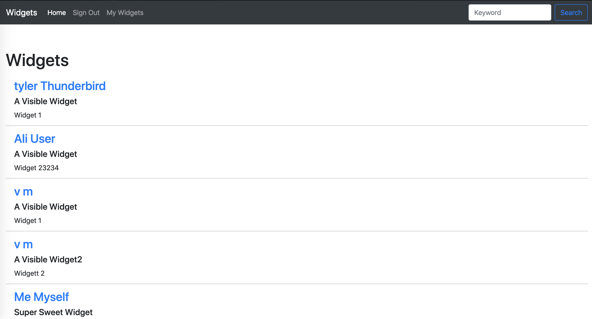

[](https://www.ruby-lang.org/en/)
[](https://rubyonrails.org/)
[](https://circleci.com/gh/hbellows/widgets)
[](https://codeclimate.com/github/hbellows/widgets/maintainability)
[](https://codecov.io/gh/hbellows/widgets)

# READ ME


## Table of Contents

* [Description/Purpose](#descriptionpurpose)
* [System Requirements](#system-requirements)
* [Initial Setup](#initial-setup)
* [Running Tests](#running-tests)
* [Dependencies](#dependencies)
* [Screenshots](#screenshots)
    * [Home Page](#home-page)
    * [User Dashboard](#user-dashboard)
* [How To Contribute](#how-to-contribute)
* [Contributors/Developers](#contributorsdevelopers)

## Description/Purpose

```
This is a small rails application that allows users to view a collection of widgets.  An unregistered or logged out user can see a page listing all of the widgets in the collection, inlcuding a link to the user who created it.  If an unregistered/logged out user clicks on the widget creator's name, they will be taken a page that show's that user's detail, along with a listing of all the widgets that user created.

An unregistered user may also register with the web app in order to login to an account.

A logged in user can view their own dashboard.  A user's dashboard will have a listing of their widgets.  A logged in user can create new widgets, delete existing widgets, see more details about a specific widget, and edit a widget.  

A registered user may update or reset a forgotten password from the log in screen.
```

## System Requirements
 - Ruby >= 2.5.1
 - Rails >= 5.2.2
## Initial Setup
1. Clone or fork this project to your local machine.
2. Run `bundle` in the project folder.
3. Run `figaro install` in the project folder.
4. Add the following API keys to config/application.yml with the variable names exactly as shown:
    - `API_CLIENT_ID`
    - `API_CLIENT_SECRET`
5. Run `rails db:{create,migrate,seed}` in the project folder.
6. To use the application locally, run `rails s` and navigate to `http:localhost:3000`
7. Or, use go [here]() to see the application live
## Running Tests
Run `rspec` to run the full test suite, or `rails s` to load up the application locally.
## Dependencies
 ### All Environments

 - [Rails](https://guides.rubyonrails.org/)
 - [Postgresql](https://www.postgresql.org/)
 - [Puma](https://github.com/puma/puma)
 - [Bootsnap](https://github.com/Shopify/bootsnap)
 - [Faraday](https://github.com/lostisland/faraday)
 - [Figaro](https://github.com/laserlemon/figaro)
 - [Fast_jsonapi](https://github.com/Netflix/fast_jsonapi)

 ### Development
 - [Rspec for Rails](https://github.com/rspec/rspec-rails)
 - [Factory Bot for Rails](https://github.com/thoughtbot/factory_bot_rails)
 - [Pry for Rails](https://github.com/rweng/pry-rails)
 - [Awesome Print](https://github.com/awesome-print/awesome_print)
 - [Fuubar](https://github.com/thekompanee/fuubar)
 
 ### Test
 - [VCR](https://github.com/vcr/vcr)
 - [Webmock](https://github.com/bblimke/webmock)
 - [Capybara](https://github.com/teamcapybara/capybara)
 - [Shoulda-Matchers](https://github.com/thoughtbot/shoulda-matchers)
 - [Database Cleaner](https://github.com/DatabaseCleaner/database_cleaner)
 - [Simplecov](https://github.com/colszowka/simplecov)
  
# How to Contribute
Widgets is an open source project. We invite your participation through issues and pull requests! 

When adding or changing a service please add tests.

Issues needing additional support:
- Desperately needs styling love!

## Screenshots
### Home Page




### User Dashboard


## Known Issues

## Contributors/Developers